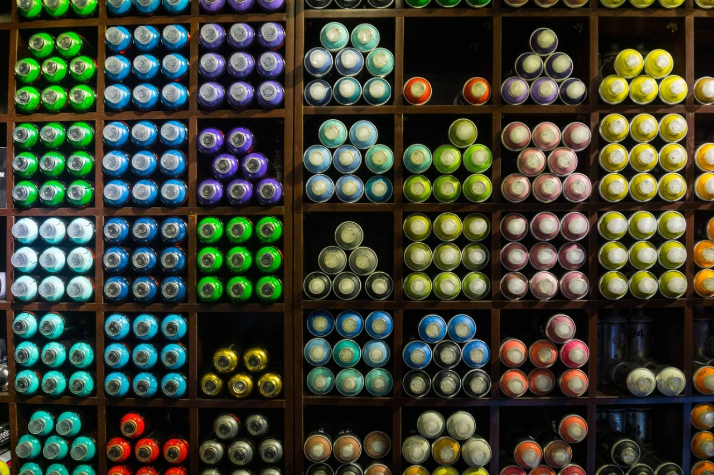
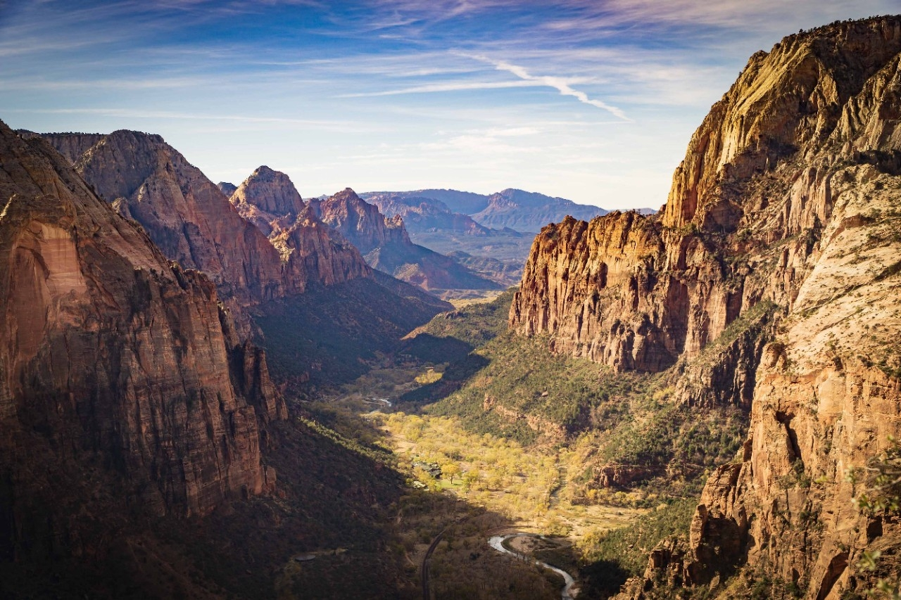

---
keywords:
  - Creative Cloud
  - API Documentation
title: Creative Cloud - Adobe Camera Raw
description: This is the home page of Adobe Camera Raw APIs 
---
 
<Hero slots="image, heading, text, buttons" variant="halfwidth" />

#  The Adobe Camera Raw SDK

Adobe Camera Raw (ACR) is the raw imaging engine that powers the Camera Raw plugin inside Photoshop, Lightroom Classic, and Lightroom. Learn how to create Profiles and Presets using Camera Raw.

* [Get the Profile SDK](https://console.adobe.io/downloads/cr)

<TextBlock slots="image, heading, text" width="33%" theme="dark" isCentered />

### Build Profiles

Learn how to incorporate 3D LUTs to create unique profiles for use in Photoshop, Camera Raw, and Lightroom.

<TextBlock slots="image, heading, text" width="33%" theme="dark" isCentered />

### Create Spectacular Effects

Create custom profiles to control light, shadow and contrast without losing visual quality, and more. Your only limit is your imagination.

<TextBlock slots="image, heading, text" width="33%" theme="dark" isCentered />

### Create Once

Create only once and use across multiple Creative Cloud applications like Photoshop and Lightroom.

<SummaryBlock slots="image, heading, text, buttons" background="rgb(9, 90, 186)" />

## Subscribe to the Creative Cloud developer newsletter 

A monthly newsletter featuring news for anyone who creates, develops, or build plugins, extensions, or integrations for the
Creative Cloud family of products.

* [Subscribe to the newsletter](https://www.adobe.com/subscription/ccdevnewsletter.html)